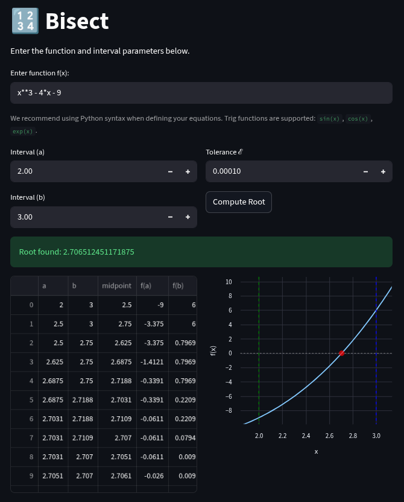

# Bisect

## Overview
**Bisect** is a deterministic, minimal-dependency numerical optimization engine engineered for robust scalar function evaluation. Built entirely from first principles following the mathematical frameworks in Edwin K. P. Chong & Stanislaw H. Zak's *"An Introduction to Optimization"*, the system features a completely decoupled computational core (`bisection_method.py`) paired with an interactive visual dashboard built on Streamlit. 

This system was originally developed as a standalone optimization tool for the **CCS 239 - Optimization Theory and Applications** course.

---

## Key Features
* **Deterministic Core Solver:** A standalone, highly decoupled Python module optimized for execution speed and floating-point precision tolerances.
* **Symbolic Expression Parsing:** Dynamic parsing of mathematical and polynomial functions via `SymPy` integration.
* **Interval Boundary Validation:** Automated runtime validation enforcing Intermediate Value Theorem thresholds before algorithm execution.
* **Iterative Convergence Tracking:** Generates granular execution logs and evaluation matrices for step-by-step matrix rendering.
* **Visual Telemetry Dashboard:** Interactive plotting layers that pinpoint calculated roots and dynamically map specified interval constraints.

---

## Bisect Image
Below is an image of the dashboard


---


## Module Usage
The core algorithm is decoupled from the rendering layer and can be imported seamlessly into any data pipeline as a standalone API.

```python
from bisection_method import find_root

# Define target continuous function
def f(x):
    return x**3 - 4*x - 9

# Execute optimization solver
root, logs = find_root(
    interval=(2, 3),       # Packing bounds as (a, b)
    tolerance=0.0001,      # Target precision threshold (epsilon)
    f=f,                   # Objective function
    print_output=True,     # Iteration stdout mirroring
    get_logs=True          # Execution log matrix retrieval
)

print(f"Calculated Root: {root}")
```
---
## Local Setup & Deployment
This project prioritizes environment reproducibility. We strongly recommend using the `uv` package manager for automated dependency synchronization.

### 1. Environment Initialization
Install the `uv` package manager locally:
```bash
# MacOS / Linux Platforms
curl -LsSf [https://astral.sh/uv/install.sh](https://astral.sh/uv/install.sh) | sh

# Windows Platforms (Run PowerShell as Administrator)
powershell -ExecutionPolicy ByPass -c "irm [https://astral.sh/uv/install.ps1](https://astral.sh/uv/install.ps1) | iex"
```
### 2. Repository Cloning & Navigation
Clone the codebase and step into the project directory:
```bash
git clone https://github.com/hydraadra112/Bisect.git
cd Bisect/
```
### 3. Dependency Sync
Synchronize your local environment dependencies.
```bash
# Recommended: Automated synchronization via uv
uv sync

# Alternative: Manual installation via pip
pip install numpy==2.3.5 pandas==2.3.3 streamlit==1.51.0 sympy==1.14.0

# Active your environment variables
source .venv/bin/activate # MacOS or Linux

.venv\Scripts\activate # For Windows
```

### 4. Launch
Boot the Bisect locally
```bash
uv run -- streamlit run streamlit_app.py
# or 
streamlit run streamlit_app.py
```
